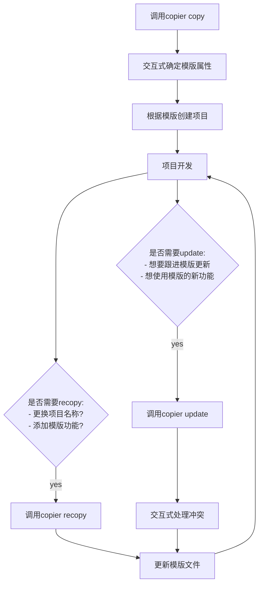

# Copier学习笔记

一个渲染项目模版Python库和命令行工具。

- 可以识别本地路径和Git URLs存储的模版。
- 项目通过ninja2了进行动态替换。
- 不会覆盖现有文件，除非被指定。

## 客户接口

Copier提供了`copier`命令行工具来执行渲染模版、重新渲染模版和跟进模版。使用的前提条件是一个满足Copier文件结构的模版文件夹。

### 命令行接口

`copier copy`

- 用于首次从模版生成新项目
- 语法:

    `copier copy <模版路径> <目标路径>`

- 会在目标路径下创建新项目，并根据模版和用户输入渲染所有文件。

`copier recopy`

- 用于已有项目，基于模版的更新或重新应用。
- 语法:

    `copier recopy <目录路径>`
- 会检测项目中的`.copier-answers.yml`文件，自动使用之前的答案和模版信息，重新渲染项目。

`copier update`

- 用于已有项目，当模版有新版本时，自动将项目升级到模版的最新版本。
- 语法:

    `copier update <项目路径>`
- 会检测项目中`.copier-answers.yml`和`.copier-template-version`文件，自动拉取模版的最新版本，并根据答案文件只更新有变更的文件，不会覆盖用户手动修改过的文件（除非强制），并支持交互式处理冲突。

### 工作流程



## Copier模版

Copier模版基本上是包含了Copier配置文件的文件夹。其中文件夹中的其余内容中可以使用ninja进行变量替换操作。

### Ninja模版语法

- `` 语句。
- `{{ ... }}` 求值表达式。
- `{# ... #}` 模版注释。

Ninja中的求值表达式即Ninja维护的Python环境的求值表达式。

Ninja支持控制语句:

- For循环:
  
    ```ninja
    
    ...
    
    ```

- If语句:
  
    ```ninja
    
    ...
    
    ...
    
    ...
    
    ```

- 宏定义(过程块):
  
    ```ninja
    
        ...
    
    ```

- 宏调用:
  
    ```ninja
    
        This is a simple dialog rendered by using a macro and
        a call block.
    
    ```

- 更多高级语言功能。

### Copier维护的Ninja全局变量

- `_copier_ansers`
- `_copier_conf`
- `os`
- `sep`
- `vsc_ref_hash`
- `_copier_python`
- `_external_data`
- `_folder_name`
- `_copier_phase`

## Copier配置文件

`copier.yml`可以定义问题变量和全局配置变量。

### 问题变量

问题变量可以具有`type`,`help`,`choices`等属性。

```yml
# copier.yml
cloud:
    type: str
    help: Which cloud provider do you use?
    choices:
        - Any
        - AWS
        - Azure
        - GCP

dependency_manager:
    type: str
    help: Which dependency manager do you use?
    choices: |
        
        - poetry
        - pipenv
        
        - npm
        - yarn
         
```

- 是否多选: **multiselct**
- 默认值: **default**
- 是否为密文: **secret**
- 多行输入: **multiline**
- 验证器: **validetor**
- 条件: **when**
  
### 配置变量

- 排除一个文件: `_exclude`
- 强制覆盖一个已存在的文件: `_force`
- 是否重写已经存在的文件: `_overwrite`
- 等
